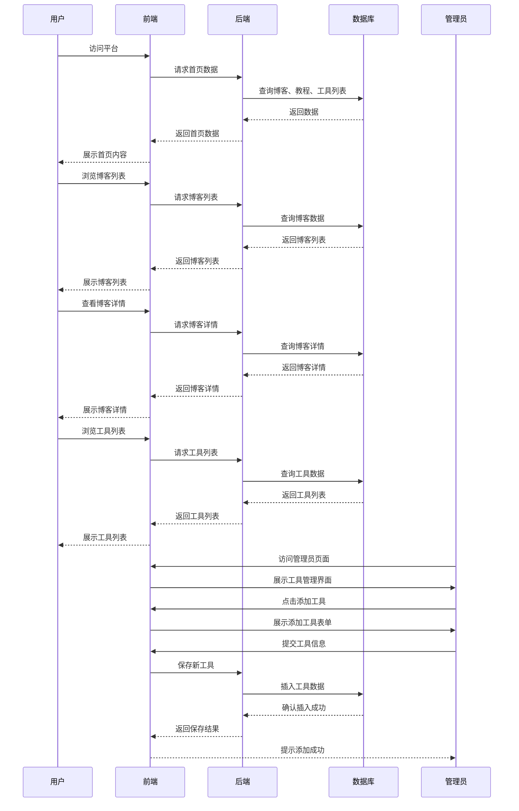
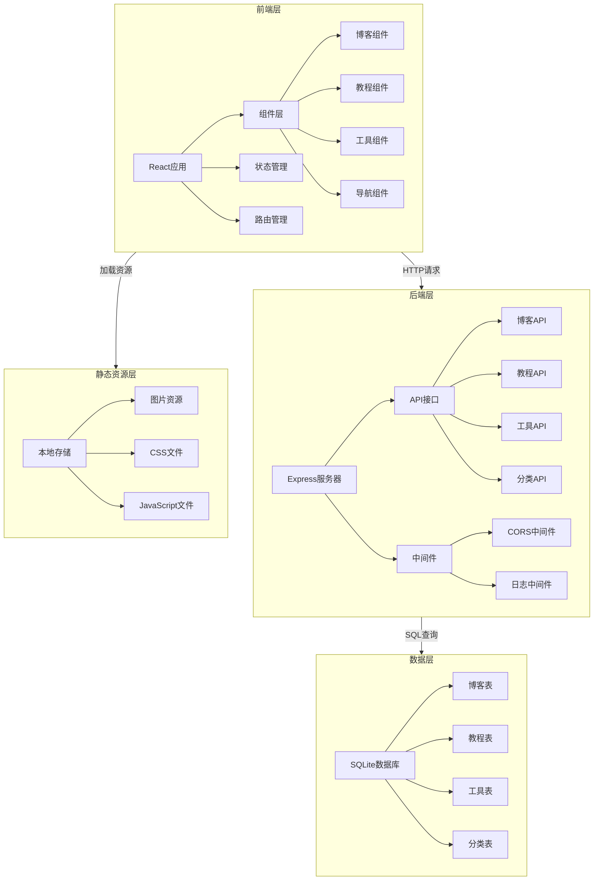

# 博客工具箱系统架构设计

## 技术选型

| 分类 | 技术 | 版本 | 选型理由 |
| :--- | :--- | :--- | :--- |
| 前端 | React + TypeScript | 18.x | 组件化开发，类型安全，生态丰富，适合构建响应式界面。 |
| 构建工具 | Vite | 5.x | 快速的开发服务器和构建工具，支持热更新，提升开发效率。 |
| 后端 | Express + Node.js | 16.x | 轻量级Web框架，易于配置，适合小型项目的API开发。 |
| 数据库 | SQLite | 3.x | 文件型数据库，无需单独部署，适合个人项目的本地存储。 |
| 样式 | Tailwind CSS | 3.x | 实用优先的CSS框架，支持响应式设计，减少CSS代码量。 |
| 状态管理 | React Context + useReducer | - | 轻量级状态管理，适合中小型应用，无需引入复杂库。 |
| 路由 | React Router | 6.x | 声明式路由，支持嵌套路由，适合构建多页面应用。 |

## 核心流程图

## 架构图

### 架构说明

1. **前端层**：
   - 使用React + TypeScript构建用户界面，组件化开发提高代码复用性。
   - **UI设计规范**：采用"Gemini Style"深色极简主题，统一背景色为 `#0b0b0f`，移除冗余装饰，强调内容沉浸感。
   - **核心组件**：
      - `ContentCard`: 通用内容卡片，统一博客、工具、教程列表的展示风格。
      - `DetailContainer`: 通用详情页容器，统一内容最大宽度、内边距和基础布局。
      - `PageLayout`: 统一页面布局容器，处理背景和侧边栏适配。
      - `ListContainer`: 统一列表状态管理（加载中、空状态、错误处理）。
    - 状态管理采用React Context + useReducer，轻量级且适合中小型应用。
   - 路由管理使用React Router，支持嵌套路由和页面导航。

2. **后端层**：
   - 使用Express + Node.js构建API服务器，处理前端的请求。
   - **错误处理机制**：基于 `AppError` 的自定义错误类体系（`ValidationError`, `NotFoundError`, `UnauthorizedError` 等），配合全局错误处理中间件确保稳定性。
   - **数据适配层**：
     - Service 层负责处理前后端数据格式差异（如将前端的数组型 `tags` 转换为数据库存储的字符串型），保持 Controller 层轻量和 Model 层纯粹。
   - API接口包括博客、教程、工具和分类的增删改查操作。
   - 中间件包括CORS中间件（处理跨域请求）和日志中间件（记录请求日志）。

3. **数据层**：
   - 使用SQLite作为数据库，文件型存储，无需单独部署，适合个人项目。
   - 数据库表结构包括博客表、教程表、工具表和分类表，对应PRD中的数据模型。
   - **自动迁移策略**：
     - 在应用启动时（`database.ts`），通过 `ensureColumn` 机制自动检测并修复数据库表结构（如补充缺失的列）。
     - 确保开发、测试、生产环境的数据库结构保持一致，降低手动维护成本。

4. **静态资源层**：
   - 使用本地存储存储静态资源，如图片、CSS和JavaScript文件。
   - 生产环境可考虑部署到GitHub Pages或Vercel等静态托管服务，降低运维成本。

### 核心模块设计

1. **博客模块**：
   - 前端：博客列表组件、博客详情组件、标签筛选组件。
   - 后端：博客列表API、博客详情API、标签筛选API。
   - 数据库：博客表，存储文章信息和标签。

2. **教程模块**：
   - 前端：教程分类组件、教程详情组件、难度筛选组件。
   - 后端：教程列表API、教程详情API、分类和难度筛选API。
   - 数据库：教程表和分类表，存储教程信息和分类数据。

3. **工具模块**：
   - 前端：工具列表组件、工具详情组件（用户页面）；工具管理组件、添加工具组件（管理员页面）。
   - 后端：工具列表API、工具详情API、添加工具API、更新工具API。
   - 数据库：工具表和分类表，存储工具信息和分类数据。

4. **可扩展性设计**：
   - 模块化架构，支持后续添加新工具和功能。
   - 组件化开发，新功能可通过添加新组件实现。
   - API接口设计遵循RESTful规范，便于后续扩展。

### 部署与运维

1. **开发环境**：
   - 前端：Vite开发服务器，热更新支持。
   - 后端：Express开发服务器，监听本地端口。
   - 数据库：SQLite本地文件数据库。

2. **生产环境**：
   - 前端：构建为静态文件，部署到GitHub Pages或Vercel。
   - 后端：部署到Heroku或Vercel的Serverless函数。
   - 数据库：SQLite文件或迁移到MongoDB Atlas等云数据库。

3. **监控与维护**：
   - 日志记录：后端请求日志，便于排查问题。
   - 错误处理：前端和后端的错误捕获与提示。
   - 定期备份：数据库和静态资源的定期备份，防止数据丢失。

此架构设计基于PRD文档的需求，采用轻量级技术栈，适合个人项目的开发和部署，同时支持后续的功能扩展。